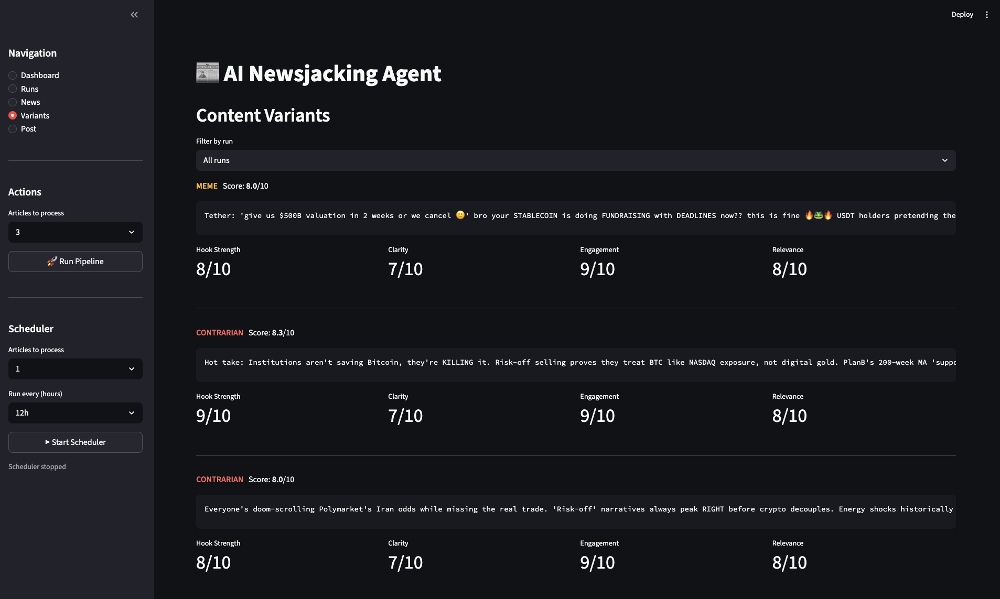

# AI Newsjacking Agent

An AI-native growth engine for the crypto market. This system autonomously detects breaking crypto news, runs it through LLM-powered sentiment and signal analysis, generates multiple content variants in distinct styles — analytical, meme, and contrarian — scores them using an LLM-as-judge rubric, and distributes the top-performing picks to Twitter/X. The entire pipeline is designed as a modular, end-to-end automation that turns real-time market events into high-converting social content without manual intervention.




## Architecture

The system follows a five-stage pipeline, orchestrated by a single `run_pipeline()` function shared across CLI, API, and scheduler execution modes.

```
News Ingestion → Analysis → Content Generation → LLM-as-Judge Scoring → Distribution
```

| Stage            | Function              | Description                                                                                    |
| ---------------- | --------------------- | ---------------------------------------------------------------------------------------------- |
| **Ingestion**    | `fetch_news()`        | Fetch crypto news from CoinGecko API, filter and deduplicate                                   |
| **Analysis**     | `analyze_news()`      | LLM-based sentiment, topic, and trading signal extraction                                      |
| **Generation**   | `generate_variants()` | Multi-style tweet generation (analytical, meme, contrarian) with per-style temperature control |
| **Scoring**      | `score_variants()`    | Weighted rubric — Hook Strength 30%, Clarity 25%, Engagement 25%, Relevance 20%                |
| **Distribution** | `post_tweet()`        | Post to Twitter/X, track outcomes in DistributionRecord                                        |

## Tech Stack

| Layer        | Technology                                                    |
| ------------ | ------------------------------------------------------------- |
| Backend      | Python, FastAPI, APScheduler                                  |
| AI/ML        | OpenAI / Claude via LiteLLM (direct prompting, no RAG)        |
| Data         | Pydantic models (in-memory, optional JSON/SQLite persistence) |
| Frontend     | Streamlit                                                     |
| Distribution | Twitter/X via Tweepy                                          |
| Resilience   | tenacity for retry with exponential backoff                   |

## Project Structure

```
src/
├── config.py                  # LLM and environment configuration
├── models/
│   ├── news.py                # NewsItem
│   ├── analysis.py            # AnalysisResult
│   ├── content.py             # ContentVariant
│   ├── distribution.py        # DistributionRecord
│   └── pipeline.py            # PipelineRun
└── modules/
    ├── ingestion.py           # CoinGecko news fetching
    ├── analysis.py            # LLM-based news analysis
    ├── generation.py          # Multi-style content generation
    └── scoring.py             # LLM-as-judge scoring and selection

tests/
├── test_models.py
├── test_ingestion.py
├── test_analysis.py
└── test_generation.py
```

## Setup

```bash
git clone https://github.com/lhty24/AI-Newsjacking-Agent.git
cd AI-Newsjacking-Agent
pip install -r requirements.txt
```

Set the required environment variables before running:

```bash
export LLM_API_KEY="your-api-key-here"
```

## Environment Variables

| Variable          | Description                  | Default       |
| ----------------- | ---------------------------- | ------------- |
| `LLM_MODEL`       | LiteLLM model identifier     | `gpt-4o-mini` |
| `LLM_API_KEY`     | API key for the LLM provider | _(required)_  |
| `LLM_TEMPERATURE` | LLM temperature for analysis | `0.3`         |
| `LLM_MAX_TOKENS`  | Max tokens per LLM response  | `1024`        |

## License

Copyright (c) 2025 Iliad AI. All rights reserved. See [LICENSE](LICENSE) for details.
