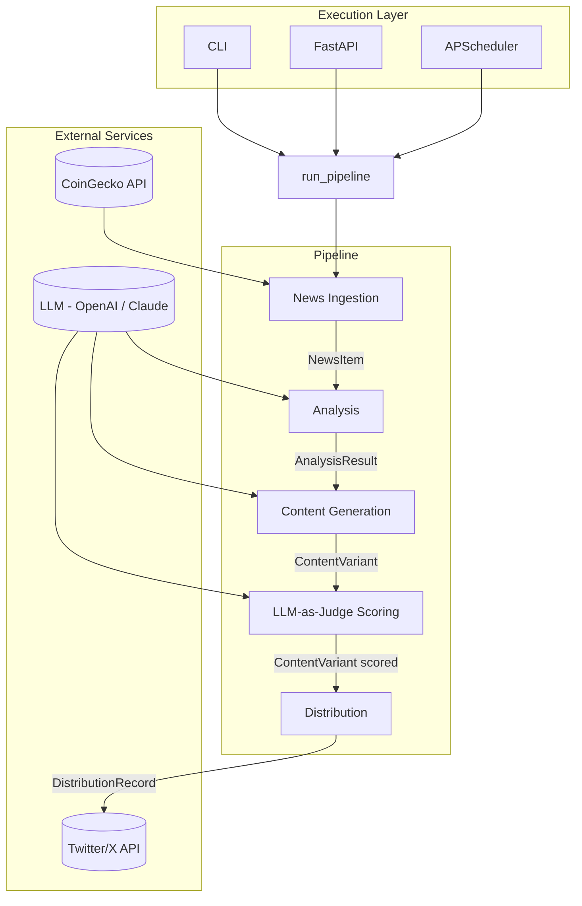

# AI Newsjacking Trading Agent

## 1. Project Scope

### Overview

The AI Newsjacking Trading Agent is a lightweight, AI-powered growth system designed to automate the process of detecting crypto market trends, generating high-converting content, and distributing it via social platforms.

The system focuses on simulating a real-world "AI-native growth engine" that integrates:

- Real-time news ingestion
- LLM-based analysis and content generation
- Automated A/B testing via LLM-as-judge scoring
- Distribution via Twitter (X)

### Goals

- Build a functional end-to-end pipeline demonstrating AI-driven growth workflows
- Simulate real-world content experimentation and optimization loops
- Provide a user-facing interface for interaction and demonstration
- Enable extensibility toward event-driven and agent-based systems

### Non-Goals

- Production-grade scalability
- Full-fledged trading execution engine
- Complex frontend application

---

## 2. Technical Stack

### Backend

- **Language:** Python
- **Framework:** FastAPI
- **Scheduler:** APScheduler

### AI / ML

- **LLM Providers:** OpenAI / Claude / LiteLLM
- **Analysis:** Direct LLM prompting with structured news context

### Data Layer

- **Models:** Pydantic (in-memory, with optional JSON serialization)
- **Persistence (optional):** SQLite for run history

### Frontend

- **Framework:** Streamlit

### Integration

- **Social API:** Twitter (X) via Tweepy

---

## 3. Detailed Architecture

The system follows a modular pipeline architecture. Three execution modes (CLI, API, Scheduler) invoke a shared `run_pipeline()` function that orchestrates the five-stage pipeline.



---

## 4. Data Model

All pipeline data is defined as Pydantic models, serving as typed contracts between modules. No database required for MVP — objects live in memory with optional JSON serialization for persistence between runs.

### 4.1 NewsItem

```python
class NewsItem(BaseModel):
    id: str                     # UUID
    source: str                 # e.g. "cryptopanic", "coingecko", "newsapi", "cryptocompare"
    title: str
    content: str
    url: str | None = None
    published_at: datetime
    tickers: list[str]          # e.g. ["BTC", "ETH"]
    fetched_at: datetime
```

### 4.2 AnalysisResult

```python
class AnalysisResult(BaseModel):
    news_item_id: str           # Reference to NewsItem.id
    sentiment: str              # "bullish" | "bearish" | "neutral"
    topics: list[str]           # e.g. ["BTC", "ETF", "regulation"]
    summary: str
    signal: str                 # e.g. "breakout potential", "sell pressure"
    analyzed_at: datetime
```

### 4.3 ContentVariant

```python
class ContentVariant(BaseModel):
    id: str                     # UUID
    analysis_id: str            # Reference to AnalysisResult
    style: str                  # "analytical" | "meme" | "contrarian"
    text: str                   # Generated tweet/thread content
    prompt_template: str        # Template name used for generation
    score: float | None = None  # LLM-as-judge score (0-10)
    score_breakdown: dict | None = None  # Rubric scores
    generated_at: datetime
```

### 4.4 DistributionRecord

```python
class DistributionRecord(BaseModel):
    id: str                     # UUID
    variant_id: str             # Reference to ContentVariant.id
    platform: str               # "twitter"
    platform_post_id: str | None = None
    status: str                 # "posted" | "failed" | "pending"
    posted_at: datetime | None = None
    error: str | None = None
```

### 4.5 PipelineRun

```python
class PipelineRun(BaseModel):
    id: str                     # UUID
    trigger: str                # "cli" | "api" | "scheduler"
    started_at: datetime
    completed_at: datetime | None = None
    status: str                 # "running" | "completed" | "failed"
    news_count: int = 0
    variants_generated: int = 0
    variants_posted: int = 0
    error: str | None = None
```

---

## 5. Component Breakdown

### 5.1 News Ingestion Module

Responsibilities:

- Fetch crypto-related news from the CoinGecko News API
- Filter relevant topics (BTC, ETH, etc.)
- Deduplicate entries by title similarity
- Normalize responses into the NewsItem model

Key Functions:

- `fetch_news() -> list[NewsItem]`

#### News Source: CoinGecko News API

- Endpoint: `https://api.coingecko.com/api/v3/news`
- Auth: None required for basic usage (optional demo API key for higher limits)
- Response mapping: `title` → title, `description` → content, `url` → url, `updated_at` → published_at, extract tickers from title/description
- Rate limit: 10–30 requests/minute depending on tier

---

### 5.2 Analysis Module

Responsibilities:

- Analyze sentiment, topics, and signals using direct LLM prompting
- Pass raw news content as context in the prompt (no embeddings or retrieval)
- Return structured analysis via Pydantic model

The LLM receives the full news article text in the prompt alongside a system prompt that specifies the desired output format. For MVP, this is a single LLM call per news item — no vector store, no embeddings, no retrieval step.

Key Functions:

- `analyze_news(item: NewsItem) -> AnalysisResult`

---

### 5.3 Content Generation Engine

Responsibilities:

- Generate multiple content variations using prompt templates
- Support different styles (analytical, meme, contrarian)
- Enable prompt-based experimentation

Key Concepts:

- Prompt engineering with style-specific system prompts
- Temperature control per style (lower for analytical, higher for meme)
- Multi-style generation from a single analysis

Key Functions:

- `generate_variants(analysis: AnalysisResult, styles: list[str]) -> list[ContentVariant]`

---

### 5.4 A/B Testing Engine (LLM-as-Judge)

Responsibilities:

- Score generated content using the LLM as an evaluator
- Rank variants by composite score
- Select top-performing variants for distribution

Implementation:

The LLM evaluates each content variant against a structured rubric:

| Criterion     | Weight | Description                                       |
| ------------- | ------ | ------------------------------------------------- |
| Hook Strength | 30%    | Does the opening line grab attention?             |
| Clarity       | 25%    | Is the message clear and easy to understand?      |
| Engagement    | 25%    | Would this drive replies, retweets, or clicks?    |
| Relevance     | 20%    | Is the content timely and tied to the news event? |

Each criterion is scored 1–10. The composite score is the weighted average. The LLM receives all variants for a given analysis in a single prompt to enable relative comparison, and returns structured JSON scores.

Key Functions:

- `score_variants(variants: list[ContentVariant]) -> list[ContentVariant]`
- `select_top_n(variants: list[ContentVariant], n: int) -> list[ContentVariant]`

Future:

- Compare LLM-scored rankings against real Twitter engagement data
- Calibrate rubric weights based on engagement correlation

---

### 5.5 Distribution Module

Responsibilities:

- Post content to Twitter via API
- Support batch posting (top-N)
- Record distribution outcome

Key Functions:

- `post_tweet(variant: ContentVariant) -> DistributionRecord`

---

### 5.6 API Layer (FastAPI)

Endpoints:

- `GET /news` — Fetch latest ingested news items
- `POST /run` — Trigger full pipeline execution
- `POST /post` — Post a specific content variant
- `GET /runs` — List recent pipeline runs with status

---

### 5.7 Frontend (Streamlit)

Responsibilities:

- Provide interactive UI for triggering pipeline
- Display results (news, analysis, generated content with scores)
- Allow manual distribution
- Show pipeline run history

---

### 5.8 Scheduler

Responsibilities:

- Automate pipeline execution at intervals

Implementation:

- APScheduler with configurable interval (default: every 30 minutes)

---

## 6. Error Handling & Resilience

The MVP takes a lightweight approach to error handling with three principles: retry, degrade gracefully, and log enough to debug.

### 6.1 Retry with Backoff

All external API calls (news APIs, LLM providers, Twitter API) use a retry decorator with exponential backoff. Implementation via `tenacity`:

```python
@retry(stop=stop_after_attempt(3), wait=wait_exponential(min=1, max=10))
def call_external_api(...):
    ...
```

This covers transient failures (timeouts, rate limits, 5xx errors) without added complexity.

### 6.2 Graceful Degradation

The pipeline does not fail entirely when a single stage partially fails:

- **News ingestion returns 0 articles:** Log a warning, skip the run, return early. No crash.
- **LLM analysis fails for one news item:** Log the error, continue processing remaining items.
- **One content variant fails to generate:** Continue with the others. A run with 2 out of 3 variants is still useful.
- **Twitter posting fails:** Save the content variant locally (JSON) so it can be retried manually or on the next run. Record `status: "failed"` with the error message in `DistributionRecord`.
- **LLM-as-judge scoring fails:** Fall back to random ranking with a logged warning. Content still gets distributed — just without optimized selection.

### 6.3 Structured Logging

Log at pipeline stage boundaries with counts and timing:

```
[2025-01-15 10:30:00] Pipeline run abc123 started (trigger: scheduler)
[2025-01-15 10:30:02] Ingestion: fetched 5 articles (2.1s)
[2025-01-15 10:30:05] Analysis: processed 5/5 articles (3.2s)
[2025-01-15 10:30:12] Generation: created 15 variants from 5 analyses (6.8s)
[2025-01-15 10:30:15] Scoring: scored 15 variants, top score 8.7 (3.1s)
[2025-01-15 10:30:17] Distribution: posted 3/3 variants (1.9s)
[2025-01-15 10:30:17] Pipeline run abc123 completed (17.1s)
```

Use Python's built-in `logging` module. No external log aggregation for MVP.

---

## 7. Development Roadmap

### Phase 1: Core Pipeline (MVP)

- [x] P1-T1: Define Pydantic data models
- [x] P1-T2: Implement news ingestion (CoinGecko News API)
- [ ] P1-T3: Build analysis module with direct LLM prompting
- [ ] P1-T4: Implement content generation with multi-style templates
- [ ] P1-T5: Implement LLM-as-judge scoring
- [ ] P1-T6: Basic CLI execution with structured logging

### Phase 2: API Layer

- [ ] P2-T1: Add FastAPI endpoints
- [ ] P2-T2: Integrate pipeline with API
- [ ] P2-T3: Add error handling (retries, graceful degradation)

### Phase 3: Frontend

- [ ] P3-T1: Build Streamlit dashboard
- [ ] P3-T2: Connect to backend APIs

### Phase 4: Distribution

- [ ] P4-T1: Integrate Twitter API
- [ ] P4-T2: Enable real posting with DistributionRecord tracking

### Phase 5: Automation

- [ ] P5-T1: Add scheduler for periodic execution

### Phase 6: Refinement

- [ ] P6-T1: Improve prompt templates
- [ ] P6-T2: Calibrate scoring rubric against real engagement
- [ ] P6-T3: Add run history persistence (SQLite)

---

## 8. Testing Strategy

### Unit Testing

- Test individual modules (ingestion, analysis, generation, scoring)
- Validate Pydantic model serialization/deserialization

### Integration Testing

- Validate full pipeline execution end-to-end

### Mock Testing (Test-Only)

- Use unittest.mock / pytest-mock to simulate external API responses during testing
- Mock news API responses with deterministic fixtures (not a runtime data source)
- Use deterministic mock LLM responses for scoring tests

### Manual Testing

- Validate UI interactions
- Verify end-to-end flow

---

## 9. Key Technical Decisions

### 1. Modular Pipeline Design

- Enables reuse across CLI, API, and scheduler
- Pydantic models as typed contracts between modules

### 2. Direct LLM Prompting (No RAG)

- News content is passed directly as context — no embeddings, vector store, or retrieval step
- Simpler architecture, fewer dependencies, faster iteration
- RAG would only add value if building a historical knowledge base of past signals (future enhancement)

### 3. LLM-as-Judge for A/B Testing

- Structured rubric scoring (hook strength, clarity, engagement, relevance)
- Enables meaningful comparison without real engagement data
- Calibration against real metrics is a natural Phase 6 extension

### 4. Pydantic-First Data Layer

- In-memory objects with typed validation
- Optional JSON serialization for persistence
- No database dependency for MVP — SQLite added only if run history persistence is needed

### 5. Streamlit for Frontend

- Fast development
- Sufficient for demo and interaction

### 6. API-Driven Architecture

- Decouples frontend from backend
- Enables future event-driven upgrades

---

## 10. Future Enhancements

### Event-Driven Architecture

- Introduce message queue (Kafka / Redis)
- Trigger pipeline on new events

### Real Engagement Feedback

- Integrate Twitter analytics
- Calibrate LLM scoring rubric against real engagement data
- Replace or augment LLM-as-judge with engagement-based ranking

### Historical Context via RAG

- Build a knowledge base of past market signals and outcomes
- Use retrieval to provide historical context for analysis
- Track signal accuracy over time

### Multi-Agent System

- Introduce agent orchestration (AutoGen / LangChain)

### Trading Integration

- Connect to real or simulated trading APIs

### Multi-Platform Distribution

- Expand to Discord, Telegram, etc.

### Advanced Analytics Dashboard

- Visualize performance trends
- Track experiment results over time

---

## Conclusion

This project demonstrates a practical implementation of an AI-native growth system that combines LLM capabilities, automation, and real-world distribution channels. It is designed to be extensible, modular, and aligned with modern AI + growth engineering paradigms.
